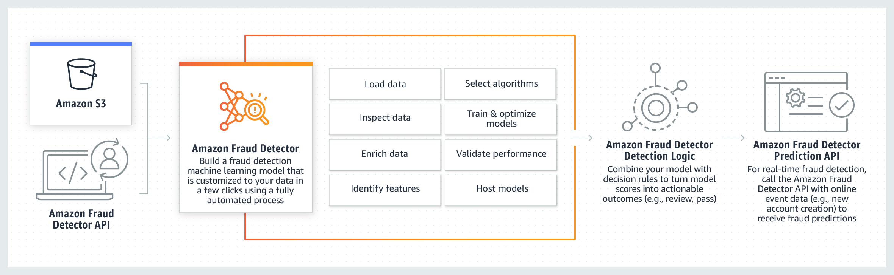

# Amazon Fraud Detector Python SDK



## Table of Contents

- [Overview](#overview)
- [Installation](#installation)
- [Documentation](#documentation)

   - [Instantiate a Fraud Detector instance](./docs/MANUAL.md/#Instantiate%20a%20Fraud%20Detector%20instance) 
   - [Profiling data](./docs/MANUAL.md/#Profiling%20Data)
   - [Train a model](./docs/MANUAL.md/#Train%20a%20model)
   - [Create a detector and activate it](./docs/MANUAL.md/#Create%20a%20detector%20and%20activate%20it)
   - [Deploy a detector](./docs/MANUAL.md/#Deploy%20a%20detector)
   - [Get predictions from a detector](./docs/MANUAL.md/#Get%20predictions%20from%20a%20detector)

- [Permissions](#permissions)
- [Security](#security)
- [Contributing](#contributing)
- [License](#license)

## Overview 
The Amazon Fraud Detector Python SDK is an open-source library that allows data
scientists and software developers to easily build, train and deploy fraud detection
models using Amazon Fraud Detector.  The primary function of this utility is to simplify using the *[Amazon Fraud Detector](https://aws.amazon.com/fraud-detector/)* product in a Python environment.

This SDK packages up the underlying API and provides a simple interface to
- Configure   
- Train
- Activate   
- Deploy  
- Predict  

An instance of a `FraudDector()` class can be used to manage the configuration and operations lifecycle of a Fraud Detector.  This manages associating rules, outcomes, event-types, labels and variables with a single detector.  
  
This SDK also includes a `Profiler()` class that profiles a sample of training data to derive the correct input format for initialising a FraudDetector instance.  This simplifies the usage the underlying fraud detection service by deriving a schema of variable and label definitions from the raw data sample.
  
It is not necessary to perform tasks such as feature engineering, model selection or hyperparameter tuning as this is managed automatically by the Amazon Fraud Detector service.


## Installation

The Amazon Fraud Detector Python SDK is available on PyPI and can be installed with
pip as follows:

```
pip install frauddetector
```

Alternatively, you can install from source by cloning this repository and running a pip install
command in the root directory of the repository:

```
git clone https://github.com/aws/amazon-fraud-detector-python-sdk.git
cd amazon-fraud-detector-python-sdk
pip install .
```

**Supported Operating Systems**

The Amazon Fraud Detector Python SDK supports Unix/Linux and Mac.

**Supported Python Versions**

The Amazon Fraud Detector Python SDK is tested on:
* Python 3.7

## Documentation

   - [Instantiate a Fraud Detector instance](./docs/MANUAL.md/#Instantiate%20a%20Fraud%20Detector%20instance) 
   - [Profiling data](./docs/MANUAL.md/#Profiling%20Data)
   - [Train a model](./docs/MANUAL.md/#Train%20a%20model)
   - [Create a detector and activate it](./docs/MANUAL.md/#Create%20a%20detector%20and%20activate%20it)
   - [Deploy a detector](./docs/MANUAL.md/#Deploy%20a%20detector)
   - [Get predictions from a detector](./docs/MANUAL.md/#Get%20predictions%20from%20a%20detector)

### Sample Notebooks

The Jupyter notebook  
+ `example/frauddetector_sdk_example.ipynb`  

provides an example of how to quickly create a running fraud detector using
the Amazon Fraud Detector Python SDK.  This notebook can either be run locally with access to an AWS cloud service configured in advance, or it can be run from within an Amazon SageMaker environment.  

Sample data is also provided in the file
+ `example/training_data/registration_data_20K_minimum.csv.zip`

This can be used as a training and test resource for familiarisation with the SDK.

#### Running notebooks locally
1. Clone this repository or download the `example/frauddetector_sdk_example.ipynb` file from the repository along with the sample data  
2. Ensure that an AWS session is authorised with access to an AWS cloud account with Amazon Fraud Detector privileges   
3. Start a Jupyter notebook session and run the examples in the notebook.  

#### Running notebooks in SageMaker
In Amazon SageMaker, upload the Jupyter notebook from the **example/** folder of this repository.

1. Run the example [Create a Notebook Instance](https://docs.aws.amazon.com/sagemaker/latest/dg/gs-setup-working-env.html) in SageMaker.
2. Add an inline policy to your Amazon SageMaker role in IAM with the following JSON structure
```
{
    "Version": "2012-10-17",
    "Statement": [
        {
            "Effect": "Allow",
            "Action": [
                frauddetector:*"
            ],
            "Resource": "*"
        }
    ]
}
```
3. Upload the Jupyter notebook and the CSV file from **example/** folder.


## Permissions

As a managed service, Amazon Fraud Detector performs operations on your behalf on
AWS hardware that is managed by Amazon Fraud Detector.  Amazon Fraud Detector can
perform only operations that the user permits.  You can read more about which
permissions are necessary in the [Amazon Fraud Detector Documentation](https://docs.aws.amazon.com/fraud-detector/latest/developer-guide/what-is.html).

The Amazon Fraud Detector Python SDK should not require any additional permissions
aside from what is required for using *boto3*.  However, if you are
using an IAM role with a path in it, you should grant permission for
``iam:GetRole``.


## Security

See https://github.com/aws-samples/amazon-fraud-detector-python-sdk/blob/main/CONTRIBUTING.md#security-issue-notifications for more information.

## Contributing
If you wish to contribute to the project, please see the [Contribution Guidelines](./CONTRIBUTING.md).

## License

Amazon Fraud Detector Python SDK is licensed under the Apache 2.0 License. It is
copyright 2021 Amazon.com, Inc. or its affiliates. All Rights Reserved. The
license is available at: http://aws.amazon.com/apache2.0/
