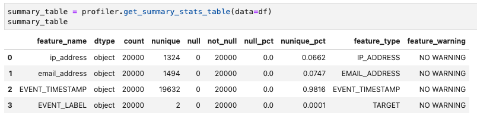

# Fraud Detector SDK User Guide 

## Data Preparation

#### Event Timestamp ####
The Amazon Fraud Detector service requires that a column called `EVENT_TIMESTAMP` is included in the data-set.
This is the timestamp when the event occurred. 
The timestamp must be in *ISO 8601 standard format in UTC* - for example `2021-12-22T03:20:11Z` (https://en.wikipedia.org/wiki/ISO_8601).

#### Event Labels ####
The Amazon Fraud Detector service requires that the outcome-label for training data is in a data-column labeled `EVENT_LABEL`. 
Data in this column must be of type *String*, not a `1`/`0` label - these should be represented as `fraud`/`legit`, or similar appropriate string label values.  
These label-strings should match the labels that are created in the Amazon Fraud Detector service's context (this can be achieved with the `FraudDetector().create_labels()` method)


# Create Fraud Detector Resources # 

## Instantiate a Fraud Detector instance

**Class** `frauddetector.FraudDetector()`  

**Parameters**  
`entity_type` : name-label for the type of fraud - EG registration, credit_card, phone_call  
`event_type` : name-label for the type of event - EG user_registration, card_transaction, CDR     
`detector_name` : name-label for this fraud detector  
`model_name` : name-label for the model  
`model_version` : version-number for the model  
`model_type` : one of `ONLINE_FRAUD_INSIGHTS` or `TRANSACTION_FRAUD_INSIGHTS` ref: https://docs.aws.amazon.com/frauddetector/latest/ug/choosing-model-type.html    
`detector_version` : version-number for this detector (combining rules, model, outcomes model)  

```python
from frauddetector import frauddetector

detector = frauddetector.FraudDetector(
    entity_type="registration",
    event_type="user-registration",
    detector_name="registration-detector",
    model_name="registration-model",
    model_version="1",
    model_type="ONLINE_FRAUD_INSIGHTS",
    detector_version="1"
    )
```

## Profiling data

The data to be profiled should include the fraud-outcome Label identifier.  This field needs to be named `EVENT_LABEL` as this naming convention is built into the product.
Assuming the data you are going to load contains the columns `EVENT_TIMESTAMP` (the timestamps of your events) and `EVENT_LABEL` (your label "legit" or "fraud"), EG


then you can use the Profiler as follows:

```python
import pandas as pd
from frauddetector import profiler

profiler = profiler.Profiler()

df = pd.read_csv("example/training_data/registration_data_20K_minimum.csv.zip")
data_schema, variables, labels = profiler.get_frauddetector_inputs(data=df)

```

View the variables structure generated by the Profiler:

```python
[{'name': 'ip_address',
  'variableType': 'IP_ADDRESS',
  'dataType': 'STRING',
  'defaultValue': 'unknown'},
 {'name': 'email_address',
  'variableType': 'EMAIL_ADDRESS',
  'dataType': 'STRING',
  'defaultValue': 'unknown'}]
```
View the labels structure generated by the Profiler:

```python
[{'name': 'legit'}, {'name': 'fraud'}]
```

If the source data column names differ from the standard Fraud Detector timestamp and event-label names, for instance your timestamp is in a column called `dttm` and the event label in a column called `event` then run the profiler as follows:

```python
data_schema, variables, labels = profiler.get_frauddetector_inputs(
    data=df,
    event_column='event',
    timestamp_column='dttm',
    filter_warnings=True)

```

Note: The `filter_warnings` flag filters data points out that produce a warning. By default it is set to `False`.

The `Profiler` class currently filters for:

* `CATEGORY`  
* `NUMERIC`  
* `IP_ADDRESS`  
* `EMAIL_ADDRESS`  

For other data types run manual pre-checks on the data. The Profiler will categorize these entries as *UNKNOWN*.

The `get_summary_stats_table()` method summarizes the categories found in the source data:

```python
summary_table = profiler.get_summary_stats_table(data=df)

```



This method also has arguments `event_column` and `timestamp_columns`.

## Train a model

First instantiate a Fraud Detector SDK instance (called `detector` in the example below)

Next configure an AWS Role with appropriate privileges to run Amazon Fraud Detector and access the training data.  
For full access privileges, use a role that has the policy `AmazonFraudDetectorFullAccessPolicy` attached to it.
```python
# https://docs.aws.amazon.com/frauddetector/latest/ug/security-iam.html
role_arn="arn:aws:iam::9999999999:role/MyFraudDetectorRole"
```
Either manually define the `variables` and `labels` definitions or use the Profiler to extract these definitions from some sample data. Make sure the field containing the fraud-outcome to train the model against is named `EVENT_LABEL`.  Then train a model using the `fit()` method:

```python
detector.fit(data_schema=data_schema
         , data_location="s3://<my-s3-bucket>/training/registration_data_20K_minimum.csv"             
         , role=role_arn
         , variables=variables
         , labels=labels)
```

## Create a detector and activate it

Provide a list of outcomes to create an active model associated with FraudDetector outcomes. Fraud Detector rules are associated with the outcomes.

First, confirm the detector instance model has completed the training phase:
```python
print(detector.model_status)
```
```
TRAINING_COMPLETE
```
Define some outcomes:
```python
outcomes = [("review_outcome", "Start a review process workflow"),
                  ("verify_outcome", "Sideline event for review"),
                  ("approve_outcome", "Approve the event")]
```
Activate the detector:
```python
detector.activate(outcomes_list=outcomes)
```
Check the status of the detector:
```python
print(detector.model_status)
```
```
ACTIVE
```

## Deploy a detector with rules
Define some *rules* to map to the *outcomes* in an activated detector.
The rule-boundry metrics can be determined  by checking the model training metrics in the AWS console.  
See the following link for more information about defining rules: https://docs.aws.amazon.com/frauddetector/latest/ug/rule-language-reference.html

```python
# this example is for applying rules to a model called registration_model
rules = [{'ruleId': 'high_fraud_risk',
                       'expression': '$registration_model_insightscore > 900',
                       'outcomes': ['verify_outcome']
                      },
        {'ruleId': 'low_fraud_risk',
                       'expression': '$registration_model_insightscore <= 900 and $registration_model_insightscore > 700',
                       'outcomes': ['review_outcome']
                      },
        {'ruleId': 'no_fraud_risk',
                       'expression': '$registration_model_insightscore <= 700',
                       'outcomes': ['approve_outcome']
                      } 
        ]

# deploy the detector with rules
detector.deploy(rules_list=rules)
```

## Get predictions from a detector

Use the `predict()` or `batch_predict()` methods to predict for a single event, passed in as a dictionary, or a batch of events passed in as a dataframe.

```python
# define event variables to pass to the detector in a dictionary structure
event_variables = {
            'email_address' : 'johndoe@exampledomain.com',
            'ip_address' : '1.2.3.4'
            }

# pass the event to an active deployed detector with an event-timestamp in ISO 8601 format 
prediction = detector.predict('2021-11-13T12:18:21Z',event_variables)
```

The detector passes back the model score and the associated rule-outcome that this triggers, for example: 
```python
{'registration_model_insightscore': 861.0,
 'ruleResults': [{'ruleId': 'low_fraud_risk', 'outcomes': ['review_outcome']}]}
```
        

# Delete Fraud Detector Resources #

Before each delete step, instantiate the Fraud Detector SDK with the correct attributes to apply the resource deletion for. 
The order of operations is important because of the dependancies between resources.
  
Instantiate SDK example:

```python
from frauddetector import frauddetector

detector = frauddetector.FraudDetector(
    entity_type="registration",            
    event_type="user-registration",        
    detector_name="registration-detector", 
    model_name="registration-model",       
    model_version="1.00",                     
    model_type="ONLINE_FRAUD_INSIGHTS",    
    detector_version="1"                   
    )   
```     
    
## Delete a Model and Rules ##    
  
Before deleting rules for a detector, deactivate the model associated with it.
```python
detector.set_model_version_inactive()
```
Wait until the model is inactive before deleting the rules:
```python
if detector.model_status == 'INACTIVE' or detector.model_status == 'TRAINING_COMPLETE':
    print("** deleting detector rules **")
    detector.delete_rules(detector.rules)
else:                      
    print("Wait until model is inactive")
    exit(0)
```

Delete the detector version:

```python
detector.delete_detector_version()
```

Get all model versions:
```python
models_json = detector.get_models()   
print(json.dumps(models_json, indent=2))
```


Delete the model version:
```python
detector.delete_model_version()
```


Delete the model:
```python
detector.delete_model()
```


Delete the detector:
```python
response = detector.delete_detector()
print(response)
```

NOTE - sometimes it may be necessary to manually delete the detector in the console.
 
## Delete Variables and Event-Type ##

```
# get the variables to delete before deleting the event-type
variables = detector.variables

detector.delete_event_type()
detector.delete_variables(variables)
```

## Delete Labels and Outcomes ##

```python

# Delete labels - not directly linked to detector-instance - they can be referenced and shared by multiple detectors
label_names = [n['name'] for n in detector.labels['labels']]
print(label_names)
detector.delete_labels(label_names)

# Delete Outcomes - not directly linked to detector-instance - they can be referenced and shared by multiple detectors
outcome_names = [o[0] for o in detector.outcomes]
print(outcome_names)
detector.delete_outcomes(outcome_names)
```