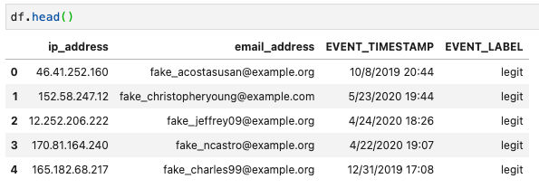

# Fraud Detector SDK User Guide 

## Instantiate a Fraud Detector instance

```python
from frauddetector import frauddetector

detector = frauddetector.FraudDetector(
    entity_type="registration",
    event_type="user-registration",
    detector_name="registration-detector",
    model_name="registration-model",
    model_version="1",
    model_type="ONLINE_FRAUD_INSIGHTS",
    detector_version="1"
    )
```

## Profiling data

Assuming the data you are going to load contains the columns **EVENT_TIMESTAMP** (the timestamps of your events) and **EVENT_LABEL** (your label "legit" or "fraud"), e.g.



then you can simply use the Profiler like follows:

```python
import pandas as pd
from frauddetector import profiler

profiler = profiler.Profiler()

df = pd.read_csv("example/training_data/registration_data_20K_minimum.csv.zip")
data_schema, variables, labels = profiler.get_frauddetector_inputs(data=df)

```

View the variables structure generated by the Profiler:

```python
[{'name': 'ip_address',
  'variableType': 'IP_ADDRESS',
  'dataType': 'STRING',
  'defaultValue': 'unknown'},
 {'name': 'email_address',
  'variableType': 'EMAIL_ADDRESS',
  'dataType': 'STRING',
  'defaultValue': 'unknown'}]
```
View the labels structure generated by the Profiler:

```python
[{'name': 'legit'}, {'name': 'fraud'}]
```

If your columns are different, for instance your timestamp is in a column called **dttm** and the event label in a column called **event** then you could run the profiler with:

```python
data_schema, variables, labels = profiler.get_frauddetector_inputs(
    data=df,
    event_column='event',
    timestamp_column='dttm',
    filter_warnings=True)

```

Note: The `filter_warnings` flag filters data points out that produce a warning. Per default it is set to **False**.

The `Profiler` class currently filters for:

* CATEGORY
* NUMERIC
* IP_ADDRESS
* EMAIL_ADDRESS

For other data types we advice to run some pre-checks on your data. The `Profiler` will catogrize these entries as **UNKNOWN**.

## Train a model

First instantiate a Fraud Detector SDK instance (called `detector` in the example below)

Next configure an AWS Role with appropriate privileges to run Amazon Fraud Detector and access the training data:
```python
# https://docs.aws.amazon.com/frauddetector/latest/ug/security-iam.html
role_arn="arn:aws:iam::9999999999:role/MyFraudDetectorRole"
```
Either manually define the `variables` and `labels` definitions or use the Profiler to extract these definitions from some sample data. Then train a model using the `fit()` method:

```python
detector.fit(data_schema=data_schema
         , data_location="s3://<my-s3-bucket>/training/registration_data_20K_minimum.csv"             
         , role=role_arn
         , variables=variables
         , labels=labels)
```

## Create a detector and activate it

Provide a list of outcomes to create an active model associated with FraudDetector outcomes. Fraud Detector rules are associated with the outcomes.

First, confirm the detector instance model has completed the training phase:
```python
print(detector.model_status)
```
```
TRAINING_COMPLETE
```
Define some outcomes:
```python
outcomes = [("review_outcome", "Start a review process workflow"),
                  ("verify_outcome", "Sideline event for review"),
                  ("approve_outcome", "Approve the event")]
```
Activate the detector:
```python
detector.activate(outcomes_list=outcomes)
```
Check the status of the detector:
```python
print(detector.model_status)
```
```
ACTIVE
```

## Deploy a detector with rules
Define some *rules* to map to the *outcomes* in an activated detector.
The rule-boundry metrics can be determined  by checking the model training metrics in the AWS console.  
See the following link for more information about defining rules: https://docs.aws.amazon.com/frauddetector/latest/ug/rule-language-reference.html

```python
# this example is for applying rules to a model called registration_model
rules = [{'ruleId': 'high_fraud_risk',
                       'expression': '$registration_model_insightscore > 900',
                       'outcomes': ['verify_outcome']
                      },
        {'ruleId': 'low_fraud_risk',
                       'expression': '$registration_model_insightscore <= 900 and $registration_model_insightscore > 700',
                       'outcomes': ['review_outcome']
                      },
        {'ruleId': 'no_fraud_risk',
                       'expression': '$registration_model_insightscore <= 700',
                       'outcomes': ['approve_outcome']
                      } 
        ]

# deploy the detector with rules
detector.deploy(rules_list=rules)
```

## Get predictions from a detector

Use the `predict()` or `batch_predict()` methods to predict for a single event, passed in as a dictionary, or a batch of events passed in as a dataframe.

```python
# define event variables to pass to the detector in a dictionary structure
event_variables = {
            'email_address' : 'johndoe@exampledomain.com',
            'ip_address' : '1.2.3.4'
            }

# pass the event to an active deployed detector with an event-timestamp in ISO 8601 format 
prediction = detector.predict('2021-11-13T12:18:21Z',event_variables)
```

The detector passes back the model score and the associated rule-outcome that this triggers, for example: 
```python
{'registration_model_insightscore': 861.0,
 'ruleResults': [{'ruleId': 'low_fraud_risk', 'outcomes': ['review_outcome']}]}
```

